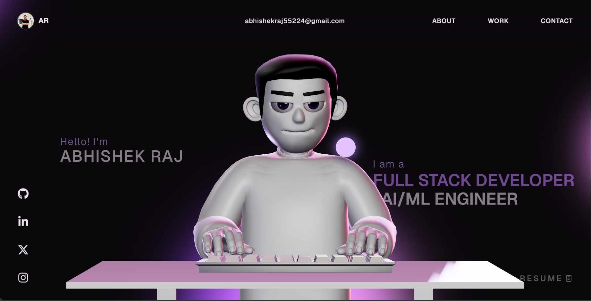

<h1 align="center">🚀 Abhishek Raj Portfolio</h1>

<p align="center">
  
</p>

<p align="center">
  <strong>Full Stack Developer • AI/ML Enthusiast • QA Engineer</strong>
</p>

<p align="center">
  <a href="https://abhishek-portfolio-topaz-one.vercel.app/">
    
  </a>
</p>

<p align="center">
  
  
  
  
  
  
</p>

---

# 🌟 Overview

A modern and interactive developer portfolio built using React, TypeScript, Three.js, GSAP, and Vite.

This portfolio showcases my professional journey, technical skills, projects, AI development experience, and provides recruiters and clients with a seamless way to connect with me.

---

# 👨‍💻 About Me

Hi, I'm **Abhishek Raj**, a B.Tech Information Technology graduate from Gautam Buddha University.

I specialize in:

* Full Stack Web Development
* Artificial Intelligence & Machine Learning
* MERN Stack Development
* Software Testing & QA Engineering
* REST API Development
* Database Design
* Problem Solving & DSA

I enjoy building scalable web applications, AI-powered systems, and modern user experiences.

---

# ✨ Features

### 🎨 Modern UI/UX

* Premium dark theme
* Responsive design
* Smooth animations
* Interactive components

### 🤖 AI Integration

* AI-powered chatbot
* Groq API integration
* Personalized portfolio assistant

### 🎮 Interactive Features

* Play With Me section
* Chess integration
* Dynamic portfolio interactions

### 🚀 Performance Optimized

* Vite-powered builds
* Code splitting
* Lazy loading
* Optimized assets

### 📱 Responsive Design

* Desktop
* Tablet
* Mobile

---

# 🛠️ Tech Stack

## Frontend

* React.js
* TypeScript
* Vite
* Three.js
* GSAP
* React Router

## Backend

* Node.js
* Express.js
* REST APIs

## Database

* MongoDB
* MongoDB Atlas

## AI & Machine Learning

* Python
* TensorFlow
* Keras
* PyTorch
* OpenCV
* Scikit-learn
* Hugging Face

## Tools & Platforms

* Git
* GitHub
* VS Code
* Postman
* Docker
* Vercel
* Render

---

# 💼 Featured Projects

## 🎵 Moodify

Emotion-based music recommendation system using AI and facial expression recognition.

**Tech:** Python, TensorFlow, React, Spotify API

---

## 🤖 Fake Instagram Account Detector

Deep Learning-based fake social media account detection system.

**Tech:** Python, OpenCV, TensorFlow, Scikit-learn

---

## 🏨 Grilli-Restro

Modern responsive restaurant website with booking functionality.

**Tech:** HTML, CSS, JavaScript

---

## 🛒 Earthkind Naturals

Full-stack e-commerce platform with authentication and product management.

**Tech:** React, Node.js, MongoDB

---

## 📄 TalentScout AI

AI-powered recruitment and resume screening platform.

**Tech:** Python, NLP, React, Flask

---

# 📸 Portfolio Preview

Visit Live Website:

### 🌐 Live Demo

https://abhishek-portfolio-topaz-one.vercel.app/

---

# ⚙️ Installation

Clone the repository:

```bash
git clone https://github.com/raj2802abhishek/abhishek-portfolio.git
```

Navigate to project:

```bash
cd abhishek-portfolio
```

Install dependencies:

```bash
npm install
```

Run locally:

```bash
npm run dev
```

Build production version:

```bash
npm run build
```

---

# 📬 Contact

### 📧 Email

[abhishekraj55224@gmail.com](mailto:abhishekraj55224@gmail.com)

### 💼 LinkedIn

[www.linkedin.com/in/abhishek-raj](http://www.linkedin.com/in/abhishek-raj)

### 💻 GitHub

https://github.com/raj2802abhishek

### 🌐 Portfolio

https://abhishek-portfolio-topaz-one.vercel.app/

---

# 📈 Current Focus

* Full Stack Development
* AI/ML Projects
* QA Engineering
* Data Structures & Algorithms
* Software Engineering Roles

---

# ⭐ Support

If you like this project, consider giving it a ⭐ on GitHub.

---

<p align="center">
Made with ❤️ by Abhishek Raj
</p>
